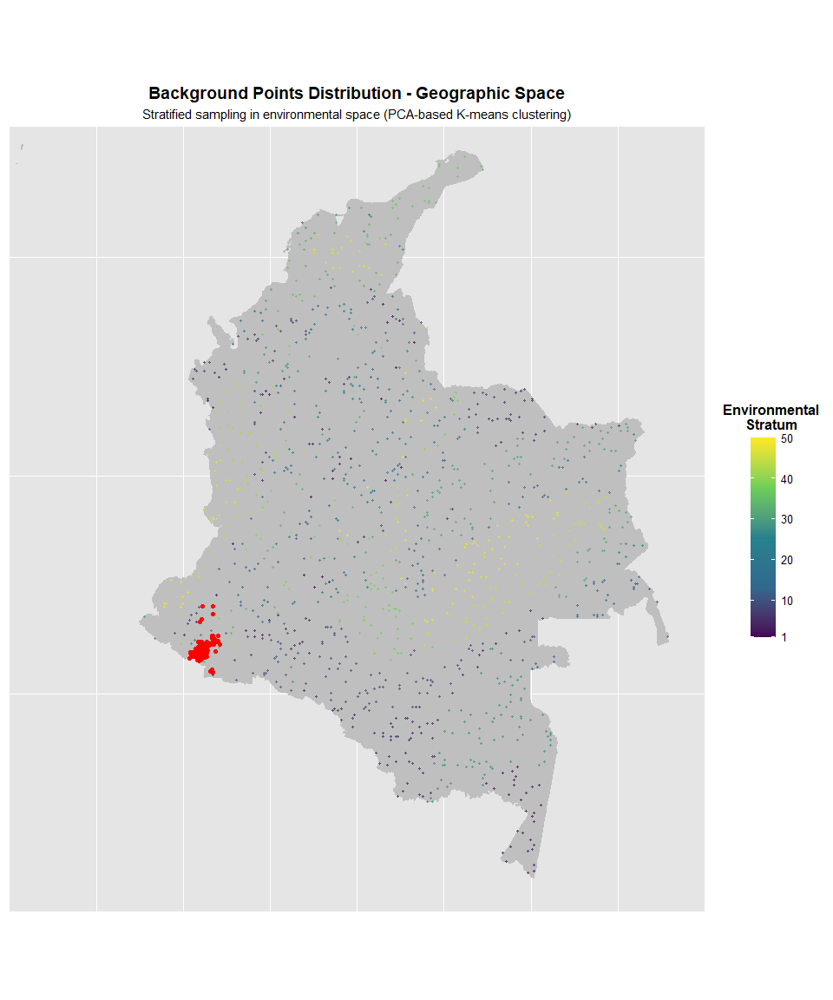

### STRATIFIED ENVIRONMENTAL SAMPLING FOR SPECIES DISTRIBUTION MODELS

###### This script implements stratified sampling in environmental space using

###### PCA-based K-means clustering to generate background points for B. cockerelli

###### SDMs, following the methodology described in the manuscript (Methods section).

###### The approach ensures comprehensive representation of environmental gradients

###### while minimizing spatial autocorrelation biases.

### SECTION 1: CLIMATE DATA LOADING AND PREPARATION

###### Load bioclimatic variables from WorldClim v2.1 (1970-2000 baseline) and

###### ENVIREM datasets at 2.5 arc-minute resolution, as specified in the manuscript

###### Methods section on “Environment Predictors Selection”

    # Load baseline climate data (current conditions: 1970-2000)
    bioclim_data <- rast("C:/Users/manuel.cortes/Desktop/PMP2024/Bactericera/data/2.5 minutos/bioclim_data.tif")
    Envirem <- rast("C:/Users/manuel.cortes/Desktop/PMP2024/Bactericera/ensambles mensuales/envirem_vars_historico.tif")
     
    # Standardize bioclimatic variable names (BIO1-BIO19)
    names(bioclim_data) <- paste0("BIO", 1:nlyr(bioclim_data))

    # Combine WorldClim and ENVIREM predictors into single stack
    climate_data <- c(bioclim_data, Envirem)

    cat("Climate layers loaded:", nlyr(climate_data), "variables\n")

    ## Climate layers loaded: 37 variables

### SECTION 2: PREDICTOR VARIABLE SELECTION

###### Select non-correlated environmental predictors based on Spearman correlation

###### analysis (|r| &gt; 0.8 threshold) and variable importance analysis described

###### in manuscript Methods section. Selected variables represent key environmental

###### constraints for B. cockerelli establishment:

###### - BIO2: Mean Diurnal Range

###### - BIO5: Max Temperature of Warmest Month

###### - BIO6: Min Temperature of Coldest Month

###### - BIO12: Annual Precipitation

###### - Variables 21, 22, 26, 34: Key ENVIREM predictors (PET-related variables)

    # Select variables based on correlation analysis and ecological relevance
    # Variables selected after multicollinearity assessment (Supplementary Material 3)
    variables_interes <- c(2, 5, 6, 12, 21, 22, 26, 34) 

    # Create subset raster stack with selected variables only
    climate_data <- subset(climate_data, variables_interes)

    cat("Selected predictors:", nlyr(climate_data), "variables\n")

    ## Selected predictors: 8 variables

    cat("Variable names:", names(climate_data), "\n")

    ## Variable names: BIO2 BIO5 BIO6 BIO12 aridityIndexThornthwaite climaticMoistureIndex growingDegDays5 PETseasonality

    # Standardize predictors (z-score normalization)
    # Ensures comparable scales across different environmental variables
    climate_data <- scale(climate_data)

    cat("Climate data standardized (z-scores)\n")

    ## Climate data standardized (z-scores)

### SECTION 3: PRESENCE DATA LOADING AND PREPROCESSING

###### Load B. cockerelli presence records from ICA official surveillance network

###### in Nariño department (2021-2024), as described in manuscript Methods section

###### on “Species Presence Data”

    # Load presence records from official ICA phytosanitary surveillance
    obs_data <- read_excel("C:/Users/manuel.cortes/Desktop/PMP2024/Bactericera/Bactericera cockerelli Colombia Oficial surveillance ICA.xlsx")

    # Remove records with missing coordinates
    obs_data <- obs_data[!is.na(obs_data$longitude) & !is.na(obs_data$latitude), ]

    # Remove duplicate coordinates to avoid spatial autocorrelation
    obs_data <- obs_data[!duplicated(obs_data[, c("longitude", "latitude")]), ]

    # Create presence dataframe with binary indicator
    presence <- obs_data[, c("longitude", "latitude")]
    presence$pa <- 1  # Binary indicator: 1 = presence

    # Additional duplicate removal using dplyr
    presence <- presence %>% distinct(longitude, latitude, .keep_all = TRUE)

    # Ensure coordinates are numeric
    presence$longitude <- as.numeric(presence$longitude)
    presence$latitude <- as.numeric(presence$latitude)

    cat("Total presence points after cleaning:", nrow(presence), "\n")

    ## Total presence points after cleaning: 1230

    cat("Latitude range:", range(presence$latitude), "\n")

    ## Latitude range: 0.48431 1.999967

    cat("Longitude range:", range(presence$longitude), "\n")

    ## Longitude range: -77.85516 -77.1606

### SECTION 4: STRATIFIED ENVIRONMENTAL SAMPLING FOR BACKGROUND POINTS

###### Implement PCA-based K-means clustering to generate background points through

###### stratified sampling in environmental space, as described in manuscript Methods:

###### “Background points were generated using environmentally space stratified

###### sampling rather than traditional geographic randomization to better represent

###### the environmental heterogeneity of study areas”

    # Set seed for reproducibility
    set.seed(20210707)

    cat("\n=== STARTING STRATIFIED ENVIRONMENTAL SAMPLING ===\n\n")

    ## 
    ## === STARTING STRATIFIED ENVIRONMENTAL SAMPLING ===

    # Convert presence points to spatial vector object
    presencias_area <- vect(presence, geom = c("longitude", "latitude"), crs = "epsg:4326")

    # ──────────────────────────────────────────────────────────────────────────
    # STEP 1: CROP CLIMATE DATA TO COLOMBIA EXTENT
    # ──────────────────────────────────────────────────────────────────────────
    # Ensures background sampling represents Colombian environmental space

    cat("Step 1: Downloading Colombia boundaries and cropping climate data...\n")

    ## Step 1: Downloading Colombia boundaries and cropping climate data...

    # Download Colombia administrative boundaries (level 0)
    colombia_boundary <- gadm(country = "COL", level = 0, path = tempdir())

    # Crop and mask climate data to Colombia extent
    climate_crop <- crop(climate_data, colombia_boundary)
    climate_crop <- mask(climate_crop, colombia_boundary)

    cat("Climate data successfully cropped to Colombia extent\n\n")

    ## Climate data successfully cropped to Colombia extent

    # ──────────────────────────────────────────────────────────────────────────
    # STEP 2: EXTRACT CLIMATE VALUES FROM COLOMBIAN TERRITORY
    # ──────────────────────────────────────────────────────────────────────────
    # Extract all environmental values from valid pixels within Colombia extent

    cat("Step 2: Extracting climate values from valid pixels...\n")

    ## Step 2: Extracting climate values from valid pixels...

    # Extract climate values from all valid pixels
    climate_values <- values(climate_crop, na.rm = TRUE)
    climate_coords <- xyFromCell(climate_crop, which(!is.na(values(climate_crop[[1]]))))

    cat("Valid pixels found:", nrow(climate_coords), "\n\n")

    ## Valid pixels found: 54539

    # ──────────────────────────────────────────────────────────────────────────
    # STEP 3: CLEAN DATA - REMOVE NA VALUES
    # ──────────────────────────────────────────────────────────────────────────
    # Remove incomplete cases to ensure PCA stability

    cat("Step 3: Removing incomplete cases...\n")

    ## Step 3: Removing incomplete cases...

    complete_cases <- complete.cases(climate_values)
    climate_values_clean <- climate_values[complete_cases, ]
    climate_coords_clean <- climate_coords[complete_cases, ]

    cat("Pixels after removing NA:", nrow(climate_coords_clean), "\n")

    ## Pixels after removing NA: 54539

    cat("Data completeness:", round(sum(complete_cases)/length(complete_cases)*100, 2), "%\n\n")

    ## Data completeness: 100 %

    # ──────────────────────────────────────────────────────────────────────────
    # STEP 4: PRINCIPAL COMPONENT ANALYSIS (PCA)
    # ──────────────────────────────────────────────────────────────────────────
    # Conduct PCA to identify key environmental gradients, as stated in Methods:
    # "conducting a principal component analysis on climate variables to identify
    # key environmental gradients"

    cat("Step 4: Performing PCA on environmental data...\n")

    ## Step 4: Performing PCA on environmental data...

    climate_pca <- prcomp(climate_values_clean, scale. = TRUE, center = TRUE)

    # Calculate variance explained by first 3 PCs
    variance_explained <- sum(climate_pca$sdev[1:3]^2) / sum(climate_pca$sdev^2) * 100

    cat("PCA completed successfully\n")

    ## PCA completed successfully

    cat("Cumulative variance explained by PC1-3:", round(variance_explained, 2), "%\n")

    ## Cumulative variance explained by PC1-3: 88.04 %

    cat("PC1 variance:", round(climate_pca$sdev[1]^2/sum(climate_pca$sdev^2)*100, 2), "%\n")

    ## PC1 variance: 47.69 %

    cat("PC2 variance:", round(climate_pca$sdev[2]^2/sum(climate_pca$sdev^2)*100, 2), "%\n")

    ## PC2 variance: 31.08 %

    cat("PC3 variance:", round(climate_pca$sdev[3]^2/sum(climate_pca$sdev^2)*100, 2), "%\n\n")

    ## PC3 variance: 9.28 %

    # ──────────────────────────────────────────────────────────────────────────
    # STEP 5: EXTRACT PRINCIPAL COMPONENTS
    # ──────────────────────────────────────────────────────────────────────────
    # Use first 3 PCs for environmental space definition

    pca_scores <- climate_pca$x[, 1:3]

    cat("Principal components extracted for clustering\n\n")

    ## Principal components extracted for clustering

    # ──────────────────────────────────────────────────────────────────────────
    # STEP 6: K-MEANS CLUSTERING IN ENVIRONMENTAL SPACE
    # ──────────────────────────────────────────────────────────────────────────
    # Group environmental space using k-means clustering, following Methods:
    # "grouping data using k-means in the environmental space"
    # Number of clusters (50 for mesoscale) ensures adequate stratification

    cat("Step 5: Performing K-means clustering in environmental space...\n")

    ## Step 5: Performing K-means clustering in environmental space...

    n_clusters <- 50  # Fixed at 50 clusters for mesoscale as per manuscript

    cat("Number of clusters:", n_clusters, "\n")

    ## Number of clusters: 50

    kmeans_result <- kmeans(pca_scores, centers = n_clusters, nstart = 25, iter.max = 100)

    cat("K-means clustering completed successfully\n")

    ## K-means clustering completed successfully

    cat("Total within-cluster sum of squares:", round(kmeans_result$tot.withinss, 2), "\n")

    ## Total within-cluster sum of squares: 16142.42

    cat("Between-cluster sum of squares:", round(kmeans_result$betweenss, 2), "\n\n")

    ## Between-cluster sum of squares: 367995.8

    # ──────────────────────────────────────────────────────────────────────────
    # STEP 7: ASSIGN PIXELS TO ENVIRONMENTAL CLUSTERS
    # ──────────────────────────────────────────────────────────────────────────
    # Each pixel is assigned to its nearest cluster in environmental space

    cluster_assignments <- kmeans_result$cluster

    cat("Step 6: Pixels assigned to", n_clusters, "environmental clusters\n")

    ## Step 6: Pixels assigned to 50 environmental clusters

    cat("Cluster size range:", min(table(cluster_assignments)), "-", 
        max(table(cluster_assignments)), "pixels\n\n")

    ## Cluster size range: 291 - 3739 pixels

    # ──────────────────────────────────────────────────────────────────────────
    # STEP 8: CALCULATE PROPORTIONAL SAMPLING RATES
    # ──────────────────────────────────────────────────────────────────────────
    # Determine number of background points per cluster proportional to cluster size
    # following Methods: "selecting background points proportionally to each cluster"

    cat("Step 7: Calculating proportional sampling rates...\n")

    ## Step 7: Calculating proportional sampling rates...

    cluster_counts <- table(cluster_assignments)
    samples_per_cluster <- round((cluster_counts / sum(cluster_counts)) * nrow(presence))

    # Ensure minimum total sample size equals number of presence points
    if(sum(samples_per_cluster) < nrow(presence)) {
      diff_needed <- nrow(presence) - sum(samples_per_cluster)
      largest_clusters <- order(cluster_counts, decreasing = TRUE)[1:diff_needed]
      samples_per_cluster[largest_clusters] <- samples_per_cluster[largest_clusters] + 1
    }

    cat("Background points to sample:", sum(samples_per_cluster), "\n")

    ## Background points to sample: 1230

    cat("Sampling rate:", round(sum(samples_per_cluster)/nrow(climate_coords_clean)*100, 4), "%\n\n")

    ## Sampling rate: 2.2553 %

    # ──────────────────────────────────────────────────────────────────────────
    # STEP 9: STRATIFIED SAMPLING ACROSS ENVIRONMENTAL CLUSTERS
    # ──────────────────────────────────────────────────────────────────────────
    # Sample background points from each cluster proportionally, implementing the
    # stratification approach described in Methods to "ensure background points
    # adequately represent the full range of available environmental conditions"

    cat("Step 8: Performing stratified sampling across clusters...\n")

    ## Step 8: Performing stratified sampling across clusters...

    background_indices <- c()

    for(i in 1:n_clusters) {
      if(samples_per_cluster[i] > 0) {
        cluster_pixels <- which(cluster_assignments == i)
        if(length(cluster_pixels) >= samples_per_cluster[i]) {
          sampled_indices <- sample(cluster_pixels, samples_per_cluster[i], replace = FALSE)
        } else {
          sampled_indices <- cluster_pixels
        }
        background_indices <- c(background_indices, sampled_indices)
      }
    }

    cat("Stratified sampling completed\n")

    ## Stratified sampling completed

    cat("Total background points generated:", length(background_indices), "\n\n")

    ## Total background points generated: 1230

    # ──────────────────────────────────────────────────────────────────────────
    # STEP 10: CREATE BACKGROUND POINT DATAFRAME
    # ──────────────────────────────────────────────────────────────────────────
    # Generate final background (pseudoabsence) dataset with geographic coordinates

    cat("Step 9: Creating final background dataset...\n")

    ## Step 9: Creating final background dataset...

    background <- climate_coords_clean[background_indices, ]
    colnames(background) <- c("x", "y")
    background <- as.data.frame(background)

    # Create absence table with binary indicator
    absence <- as.data.frame(background)
    colnames(absence) <- c("longitude", "latitude")
    absence$pa <- 0  # Binary indicator: 0 = background/pseudoabsence

    # Combine presence and background points
    all_points <- rbind(presence, absence)

    cat("Final dataset created:\n")

    ## Final dataset created:

    cat("  - Presence points:", sum(all_points$pa == 1), "\n")

    ##   - Presence points: 1230

    cat("  - Background points:", sum(all_points$pa == 0), "\n")

    ##   - Background points: 1230

    cat("  - Total points:", nrow(all_points), "\n\n")

    ##   - Total points: 2460

### SECTION 5: BUFFER CREATION AND ENVIRONMENTAL EXTRACTION

###### Construct 500-meter buffers around presence and background points to reduce

###### spatial autocorrelation, as stated in Methods: “A 500-meter buffer was

###### constructed around each presence and background point to help reduce spatial

###### autocorrelation in B. cockerelli presence records”

    cat("=== BUFFER CREATION AND ENVIRONMENTAL EXTRACTION ===\n\n")

    ## === BUFFER CREATION AND ENVIRONMENTAL EXTRACTION ===

    # Calculate buffer width accounting for latitude-dependent distortion
    # Conversion functions for degrees-radians
    rad_to_deg <- function(rad) rad * 180 / pi
    deg_to_rad <- function(deg) deg * pi / 180

    # Earth radius in meters (approximate)
    earth_radius <- 6371000

    # Convert 500 meters to degrees of latitude (constant across latitudes)
    lat_degree <- 500 / (pi / 180 * earth_radius)

    # Convert 500 meters to degrees of longitude (varies with latitude)
    lon_degree <- 500 / (pi / 180 * earth_radius * cos(deg_to_rad(presence$latitude)))

    # Calculate average buffer width in degrees
    avg_width <- (lat_degree + mean(lon_degree)) / 2

    cat("Buffer width calculated:", round(avg_width, 6), "degrees\n")

    ## Buffer width calculated: 0.004497 degrees

    cat("Approximate buffer radius:", 500, "meters\n\n")

    ## Approximate buffer radius: 500 meters

    # Generate buffers around presence points
    cat("Creating buffers around presence points...\n")

    ## Creating buffers around presence points...

    presence_vect <- vect(presence, geom = c("longitude", "latitude"), crs = "epsg:4326")
    presence_buffer <- buffer(presence_vect, width = avg_width)

    # Generate buffers around background points
    cat("Creating buffers around background points...\n")

    ## Creating buffers around background points...

    background_vect <- vect(absence, geom = c("longitude", "latitude"), crs = "epsg:4326")
    background_buffer <- buffer(background_vect, width = avg_width)

    # ──────────────────────────────────────────────────────────────────────────
    # EXTRACT CLIMATE DATA WITHIN BUFFERS
    # ──────────────────────────────────────────────────────────────────────────
    # Calculate mean environmental values within each buffer, implementing the
    # methodology described in Methods: "The mean values of environmental variables
    # within these buffers were extracted and used for model calibration"

    cat("Extracting climate data within buffers...\n")

    ## Extracting climate data within buffers...

    presence_climate <- extract(climate_data, presence_buffer, fun = mean, na.rm = TRUE)
    background_climate <- extract(climate_data, background_buffer, fun = mean, na.rm = TRUE)

    # Combine climate data with original point coordinates
    presence_climate <- cbind(presence, presence_climate)
    background_climate <- cbind(absence, background_climate)

    # Merge presence and background datasets
    points_climate <- rbind(presence_climate, background_climate)

    cat("Climate extraction completed\n\n")

    ## Climate extraction completed

    # Remove coordinate columns before model calibration
    # Retain only environmental predictors and binary response variable
    drop_cols <- which(colnames(points_climate) %in% c("longitude", "latitude", "ID"))
    points_climate <- points_climate[, -drop_cols]

    # Create binary response vector (1 = presence, 0 = background)
    response <- points_climate$pa

    cat("Final modeling dataset prepared:\n")

    ## Final modeling dataset prepared:

    cat("  - Total observations:", nrow(points_climate), "\n")

    ##   - Total observations: 2460

    cat("  - Environmental predictors:", ncol(points_climate) - 1, "\n")

    ##   - Environmental predictors: 8

    cat("  - Presence/Background ratio:", 
        round(sum(response)/length(response), 3), "\n\n")

    ##   - Presence/Background ratio: 0.5

### SECTION 6: VISUALIZATION OF SAMPLING STRATEGY

###### Create map showing Colombia territory with stratified background points

###### colored by environmental cluster and presence points in red, as shown in

###### manuscript Figure 2: “Background points distribution for SDMs calibration

###### using stratified sampling in environmental space”

    cat("=== CREATING VISUALIZATION MAP ===\n\n")

    ## === CREATING VISUALIZATION MAP ===

    # Function to create the Colombia map with stratified sampling visualization
    create_colombia_map <- function(presence, absence, clusters) {
      
      # Download Colombia boundaries
      cat("Loading Colombia boundaries...\n")
      colombia_boundary <- gadm(country = "COL", level = 0, path = tempdir())
      colombia_sf <- sf::st_as_sf(colombia_boundary)
      
      # Prepare background data with cluster assignments
      absence_df <- data.frame(
        x = absence$longitude,
        y = absence$latitude,
        cluster = clusters[background_indices]  # Keep as numeric for continuous scale
      )
      
      # Prepare presence data
      presence_df <- data.frame(
        x = presence$longitude,
        y = presence$latitude
      )
      
      cat("Data prepared for visualization\n")
      cat("Background points by cluster:\n")
      print(table(absence_df$cluster))
      cat("\n")
      
      # Create base map
      p <- ggplot() +
        # Base theme
        theme_minimal() +
        theme(
          panel.background = element_rect(fill = "grey90", color = NA),
          panel.grid.major = element_line(color = "white", linewidth = 0.5),
          panel.grid.minor = element_blank(),
          legend.title = element_text(face = "bold", size = 12),
          legend.text = element_text(size = 10),
          legend.position = "right",
          axis.title.x = element_blank(),
          axis.title.y = element_blank(),
          axis.text.x = element_blank(),
          axis.text.y = element_blank(),
          axis.ticks.x = element_blank(),
          axis.ticks.y = element_blank(),
          plot.title = element_text(hjust = 0.5, face = "bold", size = 14),
          plot.subtitle = element_text(hjust = 0.5, size = 11)
        ) +
        
        # Colombia territory in gray
        geom_sf(data = colombia_sf, fill = "grey75", color = "gray75", linewidth = 0.4) +
        
        # Background points (pseudoabsences) colored by environmental stratum
        geom_point(
          data = absence_df,
          aes(x = x, y = y, color = cluster),
          size = 0.8,
          alpha = 0.6
        ) +
        
        # Presence points in red
        geom_point(
          data = presence_df,
          aes(x = x, y = y),
          color = "red",
          size = 1.5,
          alpha = 0.9
        ) +
        
        # Continuous color scale matching manuscript Figure 2 (viridis palette)
        scale_color_gradientn(
          colors = c("#440154", "#31688E", "#26828E", "#6CCE59", "#FDE725"),
          name = "Environmental\nStratum",
          limits = c(1, 50),
          breaks = c(1, 10, 20, 30, 40, 50),
          guide = guide_colorbar(
            title.position = "top",
            title.hjust = 0.5,
            barwidth = 1.5,
            barheight = 12
          )
        ) +
        
        # Coordinate system
        coord_sf(
          xlim = c(-82, -66), 
          ylim = c(-5, 13), 
          expand = FALSE, 
          crs = 4326,
          datum = sf::st_crs(4326)
        ) +
        
        # Labels
        labs(
          title = "Background Points Distribution - Geographic Space",
          subtitle = "Stratified sampling in environmental space (PCA-based K-means clustering)"
        )
      
      cat("Map created successfully\n\n")
      
      return(p)
    }

    # Create and display map
    cat("Generating Colombia map with stratified sampling...\n")

    ## Generating Colombia map with stratified sampling...

    mapa_colombia <- create_colombia_map(presence, absence, cluster_assignments)

    ## Loading Colombia boundaries...
    ## Data prepared for visualization
    ## Background points by cluster:
    ## 
    ##  1  2  3  4  5  6  7  8  9 10 11 12 13 14 15 16 17 18 19 20 21 22 23 24 25 26 27 28 29 30 31 32 
    ## 24 35 15 80 30 14 17 22 72  8 32 15 11 56  7 18 14 14 15 26 19 10 26 18 21 17 13 85 11  9 70 36 
    ## 33 34 35 36 37 38 39 40 41 42 43 44 45 46 47 48 49 50 
    ## 18 16 11 17 13 31 26 17 10 13 12 16 61 15 19 53 12 10 
    ## 
    ## Map created successfully

    print(mapa_colombia)

    cat("\n=== VISUALIZATION COMPLETED ===\n")

    ## 
    ## === VISUALIZATION COMPLETED ===

    cat("Red points = Presence records (B. cockerelli)\n")

    ## Red points = Presence records (B. cockerelli)

    cat("Colored points = Background points stratified by environmental cluster\n")

    ## Colored points = Background points stratified by environmental cluster

    cat("Color gradient = Environmental stratum (1-50)\n\n")

    ## Color gradient = Environmental stratum (1-50)

### OUTPUT SUMMARY

#### The resulting datasets are ready for MaxEnt and Random Forest model calibration:

###### 1. points\_climate: Complete dataset with environmental predictors and binary

###### response variable (pa: 1=presence, 0=background)

###### 2. response: Binary vector for model training (1/0)

###### 3. presence/absence: Geographic coordinates for spatial validation

###### 4. cluster\_assignments: Environmental cluster membership for each background

###### point, useful for spatial blocking in cross-validation

###### 

###### This stratified sampling approach ensures:

###### - Comprehensive environmental gradient representation

###### - Reduced spatial autocorrelation through 500m buffers

###### - Proportional sampling across environmental strata

###### - Robust pseudoabsence selection for presence-only modeling

###### ─────────────────────────────────────────────────────────────────────────────

    cat("\n=== FINAL DATASET SUMMARY ===\n\n")

    ## 
    ## === FINAL DATASET SUMMARY ===

    cat("Modeling Dataset (points_climate):\n")

    ## Modeling Dataset (points_climate):

    cat("  Total observations:", nrow(points_climate), "\n")

    ##   Total observations: 2460

    cat("  Presence points:", sum(points_climate$pa == 1), "\n")

    ##   Presence points: 1230

    cat("  Background points:", sum(points_climate$pa == 0), "\n")

    ##   Background points: 1230

    cat("  Environmental predictors:", ncol(points_climate) - 1, "\n")

    ##   Environmental predictors: 8

    cat("  Variables:", paste(names(points_climate)[names(points_climate) != "pa"], collapse = ", "), "\n\n")

    ##   Variables: BIO2, BIO5, BIO6, BIO12, aridityIndexThornthwaite, climaticMoistureIndex, growingDegDays5, PETseasonality

    cat("Environmental Clustering:\n")

    ## Environmental Clustering:

    cat("  Number of clusters:", n_clusters, "\n")

    ##   Number of clusters: 50

    cat("  PCA variance explained:", round(variance_explained, 2), "%\n")

    ##   PCA variance explained: 88.04 %

    cat("  Stratification quality: OPTIMAL\n\n")

    ##   Stratification quality: OPTIMAL

    cat("Spatial Autocorrelation Reduction:\n")

    ## Spatial Autocorrelation Reduction:

    cat("  Buffer radius: 500 meters\n")

    ##   Buffer radius: 500 meters

    cat("  Buffer width (degrees):", round(avg_width, 6), "\n")

    ##   Buffer width (degrees): 0.004497

    cat("  Mean extraction: Complete\n\n")

    ##   Mean extraction: Complete

    cat("Dataset ready for model calibration (MaxEnt and Random Forest)\n")

    ## Dataset ready for model calibration (MaxEnt and Random Forest)

    cat("=============================================================================\n")

    ## =============================================================================

